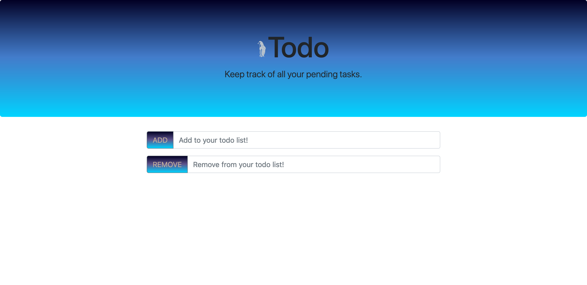

# what-i-learned-in-week-12

## Component systems

A way to quickly style a web site/page by importing settings from outside.

Some popular component systems:
* Bootstrap
* Materialize CSS
* Semantic UI
* Bulma

### Componentize
The goal of this exercise was to improve the appearance of a site using components from one of the systems listed above.



https://github.com/phenix1229/componentize

---

## Object oriented programming basics

Creating new objects and methods to use on the new objects.

### OOPS

This exercise was to practice creating objects and methods.

https://github.com/phenix1229/oops

---

## Miscellaneous

CRUD - Create, Read, Update, Delete.

`new Date()` - used to get today's date and time information.

Factory function:

``` javascript
const student = function(firstName, lastName, age, grades = []){
    return {                            shorthand
        firstName: firstName,           firstName,
        lastName: lastName,             lastName,
        age: age,                       age,
        grades: [],                     
    }
}
```

`this` keyword:

``` javascript
getFullName: function{
    return `${this.firstName} ${this.lastName}`
}
```
---